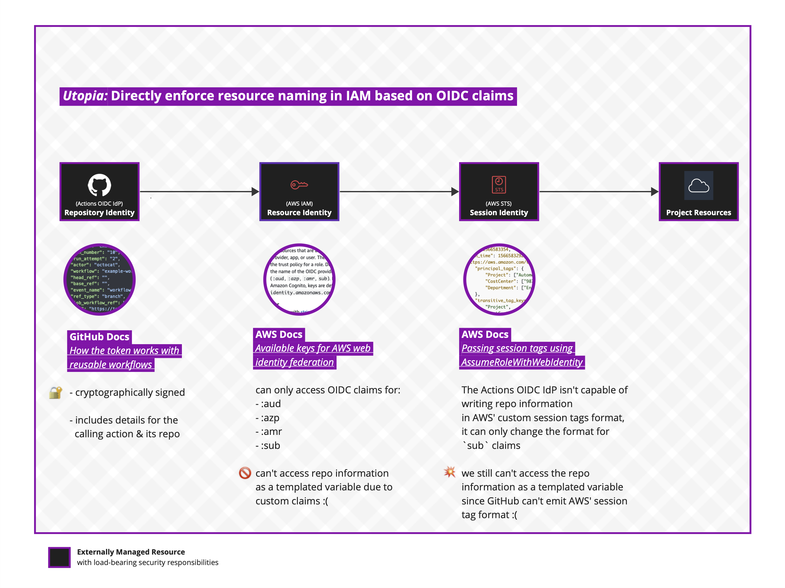
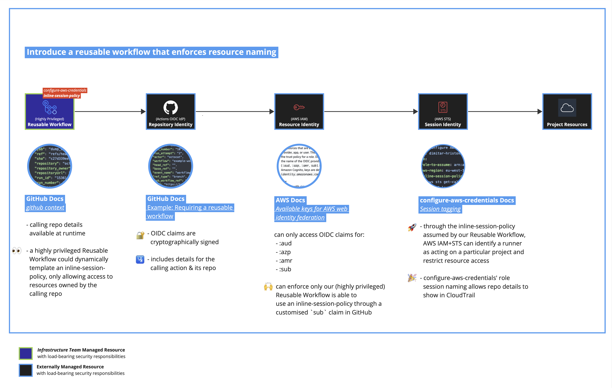

# gha-aws-oidc-sample
End-to-end demonstration of enforcing per-repo privileges on AWS with GitHub Actions OIDC.

## Context and problem statement
We'd like to use [GitHub Actions' OIDC IdP](https://docs.github.com/en/enterprise-cloud@latest/actions/deployment/security-hardening-your-deployments/configuring-openid-connect-in-cloud-providers) for directly presenting repository identities to AWS for authentication+authorisation control, hoping we'll be able to mostly get rid of AWS Access Key secrets and IAM Instance Roles across our CI estate.

Unfortunately, despite AWS' support for OIDC with IAM and GitHub Actions' OIDC IdP, the AWS community has experienced long-standing issues with presenting a repository identity for use during IAM policy evaluation.

<details>
<summary>Utopia: Directly enforce resource naming in IAM based on OIDC claims</summary>

### Utopia: Directly enforce resource naming in IAM based on OIDC claims

[](docs/diagram-utopia.pdf)

> While directly enforcing resource naming in IAM based on OIDC claims would be the best option toward reducing the number of internally-managed components in the security critical path, we’re unable to take this option today due to parallel blockers on GitHub and AWS' issuance and de-marshalling of OIDC JWT tokens (respectively).
> 
> 
> #### Blockers
> 
> * https://github.com/orgs/community/discussions/12031
> * https://github.com/aws-actions/configure-aws-credentials/issues/419
> 
> (see also, Aidan Steele's 2021 blog post: [AWS IAM OIDC IDPs need more controls](https://awsteele.com/blog/2021/10/12/aws-iam-oidc-idps-need-more-controls.html))

</details>


In this repository, we show off using a Reusable Workflow to provide AWS IAM with repository information through an [inline session policy](https://github.com/aws-actions/configure-aws-credentials#inline-session-policies) while also enforcing use of the Reusable Workflow through a [customised `sub` claim](https://docs.github.com/en/enterprise-cloud@latest/actions/deployment/security-hardening-your-deployments/about-security-hardening-with-openid-connect).

Hoping for a future where either AWS or GitHub are able to unblock us, we also call out future migration ‘escape path’s against our presented workaround.


## Contents
* [cfn.yaml](cfn.yaml): CloudFormation template
  * [AWS::IAM::OIDCProvider](https://docs.aws.amazon.com/AWSCloudFormation/latest/UserGuide/aws-resource-iam-oidcprovider.html), to configure GitHub Actions' OIDC provider with AWS
  * [AWS::S3::Bucket](https://docs.aws.amazon.com/AWSCloudFormation/latest/UserGuide/aws-properties-s3-bucket.html), to hold files uploaded by GitHub Actions
  * [AWS::IAM::Role](https://docs.aws.amazon.com/AWSCloudFormation/latest/UserGuide/aws-resource-iam-role.html), to allow a reusable workflow broad access to the aforementioned S3 bucket

* [.github/workflows/reusable-s3.yaml](.github/workflows/reusable-s3.yaml): Reusable Workflow
  * [aws-actions/configure-aws-credentials](https://github.com/aws-actions/configure-aws-credentials), to establish a session with AWS IAM/STS
  * [actions/download-artifact](https://github.com/actions/download-artifact), to retrieve artifacts uploaded by earlier jobs
  * [AWS CLI](https://aws.amazon.com/cli/), for uploading artifacts to AWS S3

* [.github/workflows/main-s3.yaml](.github/workflows/main-s3.yaml): Unit test workflow
  * Demonstrate creating a test file and uploading it to S3, under a bucket prefix determined by the repo name

## Deploying
1. Create a new GitHub repo

2. Configure fork / branch protection settings (see also, § [Guarding against malicious forks](README.md#guarding-against-malicious-forks))

2. Make a GitHub REST API call to [Set the customization template for an OIDC subject claim for a repository](https://docs.github.com/en/enterprise-cloud@latest/rest/actions/oidc?apiVersion=2022-11-28#set-the-customization-template-for-an-oidc-subject-claim-for-a-repository)

```bash
curl --request PUT \
  --url https://api.github.com/repos/$GH_ORG/$GH_REPO/actions/oidc/customization/sub \
  --header 'Accept: application/vnd.github+json' \
  --header 'Authorization: Bearer $GH_TOKEN' \
  --data '{"use_default":false,"include_claim_keys":["repo","context","job_workflow_ref"]}'
```

3. Deploy [cfn.yaml](cfn.yaml) with AWS CloudFormation

4. Update environment variables in [.github/workflows/reusable-s3.yaml](.github/workflows/reusable-s3.yaml) (`BUCKET`, `ROLE_TO_ASSUME`, and `REGION`) to match your AWS account using the CloudFormation outputs

4. Observe GitHub Actions authenticating to AWS with OIDC before uploading a test file

## Design: Introduce a Reusable Workflow that enforces resource naming
[](docs/diagram-reality.pdf)

While GitHub Actions doesn’t allow generally customising its OIDC claims format, we can require `job_workflow_ref` be included in the `sub` claim and reference this in an AWS IAM policy to restrict access to a Reusable Workflow managed by our infrastructure team.

This workflow can then use an [inline session policy](https://github.com/aws-actions/configure-aws-credentials#inline-session-policies) (via [aws-actions/configure-aws-credentials#739](https://github.com/aws-actions/configure-aws-credentials/pull/739)) and provide reduced privileges scoped to the repository identity.


#### Escape Path 🏃

* Assuming GitHub introduce support for custom OIDC claims:

  * we could emit OIDC claims directly from GitHub in AWS' Session Tags format, obviating our need for the Reusable Workflow’s initial highly privileged policy.

* Assuming AWS introduce support for reading arbitrary OIDC claims:

  * we could create IAM policies that directly provide reduced privileges based on the repository identity, obviating our need for the Reusable Workflow’s initial highly privileged policy.


#### Downsides 😥

  * We place load bearing security responsibilities upon our Reusable Workflow, significantly increasing the risk of a *[confused deputy problem](https://docs.aws.amazon.com/IAM/latest/UserGuide/confused-deputy.html)* through logic or parameter escaping issues


#### Upsides 🚀

  * We can introduce override logic inside the Reusable Workflow for projects that need non-standard AWS resource names


## Security Properties
### Reducing Privileges at Runtime

Since [passing session tags using AssumeRoleWithWebIdentity](https://docs.aws.amazon.com/IAM/latest/UserGuide/id_session-tags.html#id_session-tags_adding-assume-role-idp) requires a proprietary `https://aws.amazon.com/tags` claim [that GHA can't emit as of 2023](https://github.com/orgs/community/discussions/12031), we're unable to immediately rely on session tagging for isolating resources with an IAM role policy.

Instead, we use the [`github` context](https://docs.github.com/en/enterprise-cloud@latest/actions/learn-github-actions/contexts#github-context) to inject the repository identity into an [inline session policy](https://github.com/aws-actions/configure-aws-credentials#inline-session-policies).

https://github.com/Skyscanner/gha-aws-oidc-sample/blob/2b8d2ee21067f7a8310443c6f428e18973614927/.github/workflows/reusable-s3.yaml#L55-L89

This happens during a single call to [AssumeRoleWithWebIdentity](https://docs.aws.amazon.com/STS/latest/APIReference/API_AssumeRoleWithWebIdentity.html), so we don't expect e.g., early crashes in our Reusable Workflow to be useful for privilege escalation.

We also use the `RoleSessionName` parameter ([on AssumeRoleWithWebIdentity](https://docs.aws.amazon.com/STS/latest/APIReference/API_AssumeRoleWithWebIdentity.html)) to ensure the repository identity is recorded in CloudTrail.

### Requiring use of our Reusable Workflow
> [!NOTE]
> As of 2023, this requires a per-repo GitHub REST API call to [Set the customization template for an OIDC subject claim for a repository](https://docs.github.com/en/enterprise-cloud@latest/rest/actions/oidc?apiVersion=2022-11-28#set-the-customization-template-for-an-oidc-subject-claim-for-a-repository).
>
> We've observed just calling [Set the customization template for an OIDC subject claim for an organization](https://docs.github.com/en/enterprise-cloud@latest/rest/actions/oidc?apiVersion=2022-11-28#set-the-customization-template-for-an-oidc-subject-claim-for-an-organization) isn't enough to include `job_workflow_ref` in the `sub` claim.
>
> Trying to access AWS from a repository with an uncustomised OIDC subject claim template (or trying to assume the IAM role without using the Reusable Workflow) will cause AWS to return `Error: Not authorized to perform sts:AssumeRoleWithWebIdentity`.
>
> ---
> **GitHub Docs** [Example: Requiring a reusable workflow](https://docs.github.com/en/enterprise-cloud@latest/actions/deployment/security-hardening-your-deployments/about-security-hardening-with-openid-connect)

In an effort to reduce the attack surface for our (initially) widely privileged IAM role, we make use of GitHub Actions OIDC IdP's [subject claim customisation](https://docs.github.com/en/enterprise-cloud@latest/actions/deployment/security-hardening-your-deployments/about-security-hardening-with-openid-connect#customizing-the-subject-claims-for-an-organization-or-repository) to indicate our Reusable Workflow's identity. This `job_workflow_ref` claim is then declared as a condition to our `AssumeRolePolicyDocument`.

https://github.com/Skyscanner/gha-aws-oidc-sample/blob/2b8d2ee21067f7a8310443c6f428e18973614927/cfn.yaml#L53-L64


### Guarding against malicious forks
We leverage "[Approving workflow runs from private forks](https://docs.github.com/en/enterprise-cloud@latest/actions/managing-workflow-runs/approving-workflow-runs-from-private-forks)" to ensure the `sub` claim for `job_workflow_ref` can't be confused through unexpected PRs against our Reusable Workflow.

Additionally, we use [branch protection rules](https://docs.github.com/en/enterprise-cloud@latest/repositories/configuring-branches-and-merges-in-your-repository/managing-protected-branches/managing-a-branch-protection-rule#creating-a-branch-protection-rule) to ensure only our infrastructure team is able to create new branches that are accepted by our IAM role's `job_workflow_ref` condition.


### Separating execution environments
> [!WARNING]
> If your reusable workflow provides a customer execution environment (e.g., for Docker image
> building), you **must** ensure the `ACTIONS_RUNTIME_TOKEN` and `ACTIONS_ID_TOKEN_REQUEST_URL`
> environment variables are not accessible.
>
> ---
> **GitHub Docs** Configuring OpenID Connect in cloud providers § [Using custom actions](https://docs.github.com/en/enterprise-cloud@latest/actions/deployment/security-hardening-your-deployments/configuring-openid-connect-in-cloud-providers#using-custom-actions)

GitHub Actions allows jobs to request an OIDC token by making a request to `ACTIONS_ID_TOKEN_REQUEST_URL` using `ACTIONS_RUNTIME_TOKEN`.

If these environment variables are accesible by a customer execution environment hosted by your reusable workflow, an attacker could achieve privilege escalation by asking GitHub Actions for a fresh OIDC token and skipping the `inline-session-policy`.

## Further Reading

  * Aidan Steele's 2021 blog post: [AWS IAM OIDC IDPs need more controls](https://awsteele.com/blog/2021/10/12/aws-iam-oidc-idps-need-more-controls.html)
    * https://github.com/orgs/community/discussions/12031
    * https://github.com/aws-actions/configure-aws-credentials/issues/419
  * **AWS Docs** [Available keys for AWS web identity federation](https://docs.aws.amazon.com/IAM/latest/UserGuide/reference_policies_iam-condition-keys.html#condition-keys-wif)
  * **AWS Docs** [Passing session tags using AssumeRoleWithWebIdentity](https://docs.aws.amazon.com/IAM/latest/UserGuide/id_session-tags.html#id_session-tags_adding-assume-role-idp) (not available with GHA as of 2023)
  * **AWS Docs** [The confused deputy problem](https://docs.aws.amazon.com/IAM/latest/UserGuide/confused-deputy.html)
  * **GitHub Docs** [Configuring OpenID Connect in Amazon Web Services](https://docs.github.com/en/enterprise-cloud@latest/actions/deployment/security-hardening-your-deployments/configuring-openid-connect-in-amazon-web-services)
  * **GitHub Docs** Configuring OpenID Connect in cloud providers § [Using custom actions](https://docs.github.com/en/enterprise-cloud@latest/actions/deployment/security-hardening-your-deployments/configuring-openid-connect-in-cloud-providers#using-custom-actions)
  * **GitHub Docs** [Example: Requiring a reusable workflow](https://docs.github.com/en/enterprise-cloud@latest/actions/deployment/security-hardening-your-deployments/about-security-hardening-with-openid-connect#example-requiring-a-reusable-workflow)
  * **GitHub Docs** [`github` context](https://docs.github.com/en/enterprise-cloud@latest/actions/learn-github-actions/contexts#github-context)
  * **configure-aws-credentials Docs** [Inline session policies](https://github.com/aws-actions/configure-aws-credentials#inline-session-policies)
  * **configure-aws-credentials Docs** [Session tagging](https://github.com/aws-actions/configure-aws-credentials#session-tagging)
